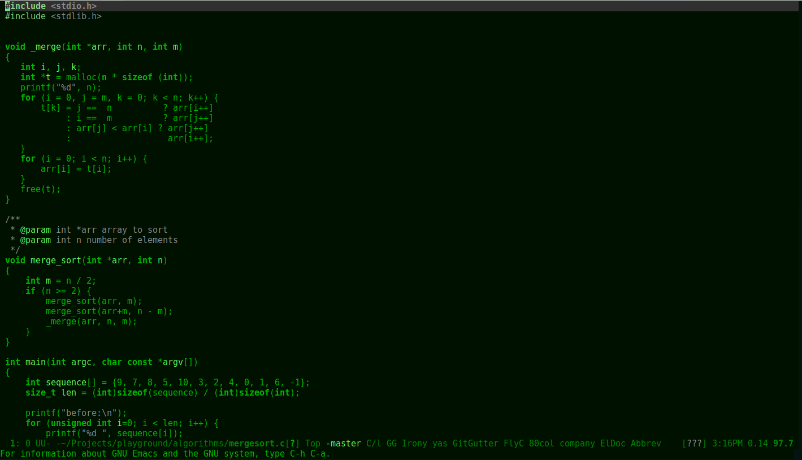
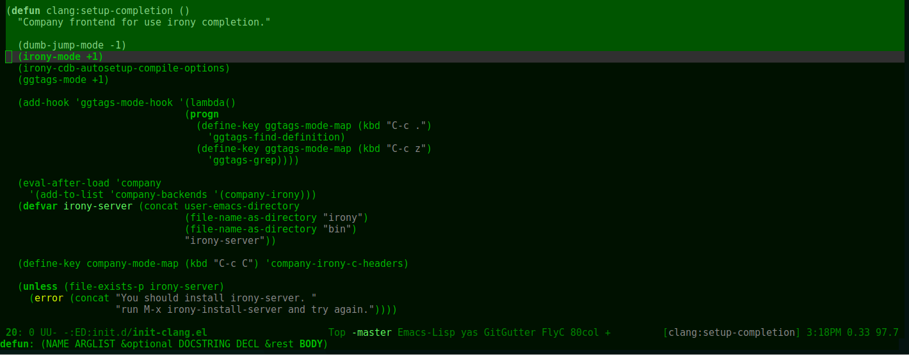

# Emacs Green Is The New Black - Theme

Green Is The New Black is a blackened green and minimalist theme for Emacs.
With coherent hight-light and 256color terminals support.

[](https://melpa.org/#/green-is-the-new-black-theme)


## Screenshots




## Supported Modes

* company
* flycheck
* ido
* column-enforce-mode
* smart-mode-line
* doom-mode-line
* and many others coming

## Installation

You should install from MELPA

<kbd>M-x package-install RET green-is-the-new-black-theme</kbd>

Add at your emacs.d/init.el

```
(load-theme 'green-is-the-new-black-theme t)
```
